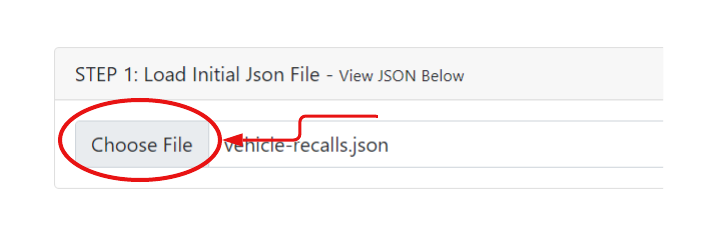
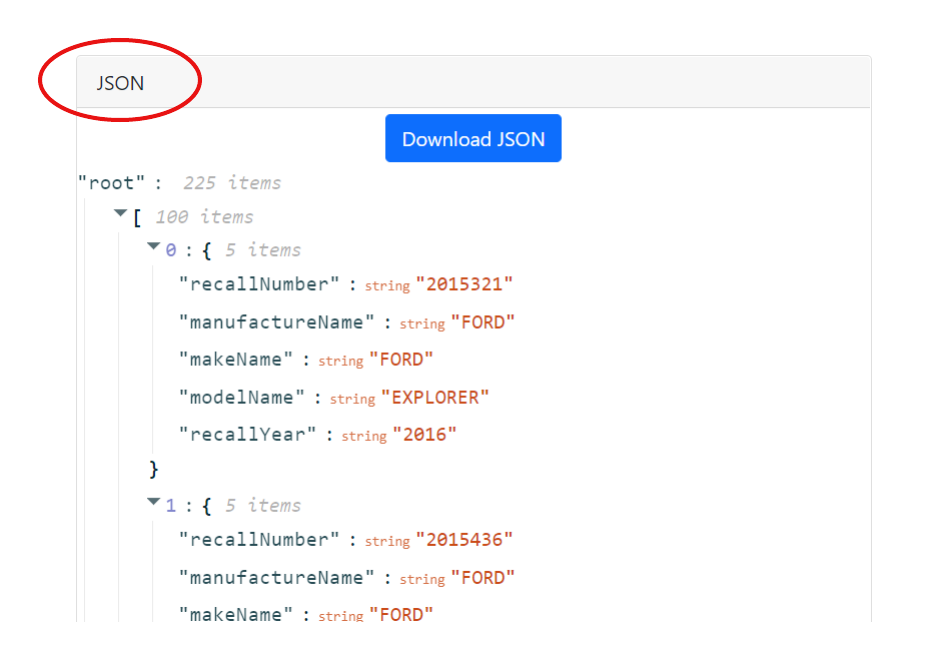
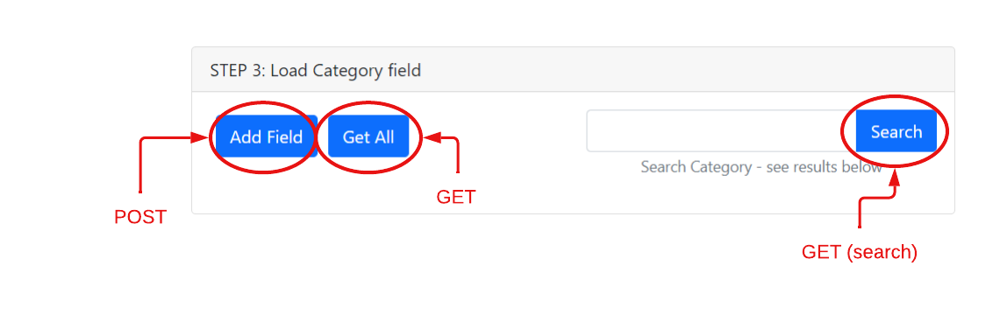

# Vehicle Recall Enhancement

It consists of a front-end app and 4 back-end web apis.

- The front-end app is written in React. 

- 4 back-end web apis are written in different languages/framework (they run independently):

  - API 1 is written in Javascript by Mubarak Oseni.

  - API 2 is written in  by Katya Batura.

  - API 3 is written in Java by Peter Londry.

  - API 4 is written in .net 6 by Wu Ding.  


Recommended browsers are Chrome, Microsoft Edge, and Firefox since our app is fully tested in these browsers.

## Running Locally
1. Clone repository
```shell
> git clone https://github.com/plondry/vehicle-recall-ui.git
> cd vehicle-recall-ui
```
2.  Start Frontend and APIs - see below.

### Starting the Frontend App
1. Install NodeJS (https://nodejs.org/en/)
2.  Run the following commands:
```shell
> git clone https://github.com/plondry/vehicle-recall-ui.git
> cd vehicle-recall-ui
vehicle-recall-ui> npm install
vehicle-recall-ui> cd app
vehicle-recall-ui\app> npm install
vehicle-recall-ui\app> npm start
```

### Starting API 1
API 1 is built with nodejs and express

You must have **Node v14.17.2* installed on your computer


```
#Install server dependencies
cd /apis/API1
npm install

#Start API1 Server
node server.js

In case of error : throw new Error('`' + path + '` may not be used as a schema pathname');
This error can be fixed by going to the scheme.js file at 
vehicle-recall-ui/apis/API1/node_modules/mongoose/lib/schema.js 
and comment out // "reserved.modelName ="
```

### Starting API 2

### Starting API 3 
API 3 is a Java Spring Boot application built using Gradle. 

You must have **Java 11 JDK** installed on your
  computer. (https://www.oracle.com/java/technologies/javase/jdk11-archive-downloads.html) 

You can build a jar file and run it from the command line:
```shell
vehicle-recall-ui> cd apis/API3/
vehicle-recall-ui\apis\API3> gradlew build
vehicle-recall-ui\apis\API3> java -jar ./build/libs/vrd-api-1.0.0.jar
```
For more information on API 3, see [API 3's README](https://github.com/plondry/vehicle-recall-ui/tree/main/apis/API3)
### Starting API 4
  1. Install Visual Studio 2022 and install .net 6 SDK.
  
  2. Open apis\API4\TCVrdWebApi\TCVrdWebApi.sln in Visual Studio 2022
  
  3. Set the project "TCVrdWebApi" as startup project

  4. Press F5 do run the project "TCVrdWebApi". If you see a browser is launched with http://localhost:3004/swagger/index.html, api4 webapi is running!


# API 1 Introduction
API1 is written in Javascript and located in apis\API1.

## Endpoints Definiton:

Post endpoint is: http://localhost:3001/v1/api/vehicle-recalls

GetAll endpoint is: http://localhost:3001/v1/api/vehicle-recalls

GetByValue retrieval endpoint is: http://localhost:3001/v1/api/vehicle-recalls/?manufacturer_recall_no_txt={value}
  


# API 2 Introduction

# API 3 Introduction
API3 is written in Java and located in apis\API3.

## Endpoints Definiton:

Post endpoint is: http://localhost:3003/v1/api/vehicle-recalls

GetAll endpoint is: http://localhost:3003/v1/api/vehicle-recalls

GetByValue retrieval endpoint is: http://localhost:3003/v1/api/vehicle-recalls/search?value={value}

# API 4 Introduction

API4 is written in .net 6 and located in apis\API4.

The controller file is at .\apis\API4\TCVrdWebApi\TCVrdWebApi\Controllers\VrdProcessorApi4Controller.cs.

## Endpoints Definiton:

Post endpoint is: http://localhost:3004/v1/api/vehicle-recalls

GetAll endpoint is: http://localhost:3004/v1/api/vehicle-recalls

GetByValue retrieval endpoint is: http://localhost:3004/v1/api/vehicle-recalls/search?value={value}


# Front End App Introduction

The front end app is written in React.

To use the App, once it's started, open a browser and go to http://localhost:3000

1.  Load the initial JSON file using the file selector at the top of the page.



- The JSON will load and can be viewed in the JSON panel at the bottom of the screen.  This panel will let you download the current JSON at any point in the process.  You can then use the cached JSON or reload the JSON file using step 1 above.
  

2. For each of the API Steps, you can click on the following buttons
  * `Add Field` - This will invoke the `POST` request on the API, passing in the cached JSON in the web app (in the JSON panel) - The results of this service request will be presented in the JSON Panel at the bottom of the page.
  * `Load All` - This will invoke the `GET` request on the API, and refresh the web app JSON cache (in the JSON panel)
  * `Search` - This will invoke the `GET` search request on the API and load the results in the `Search Results` panel at the bottom of the screen.  You can also download this JSON file.
   
